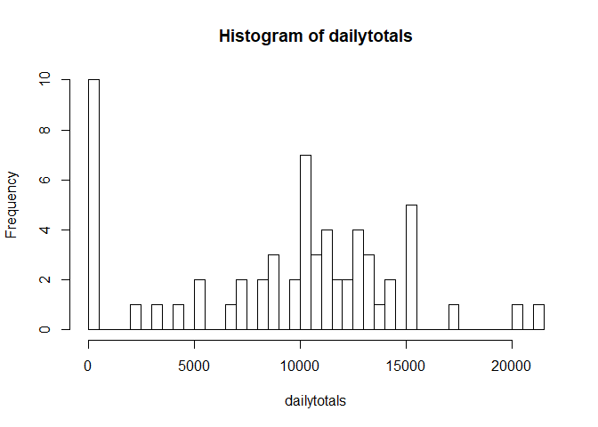
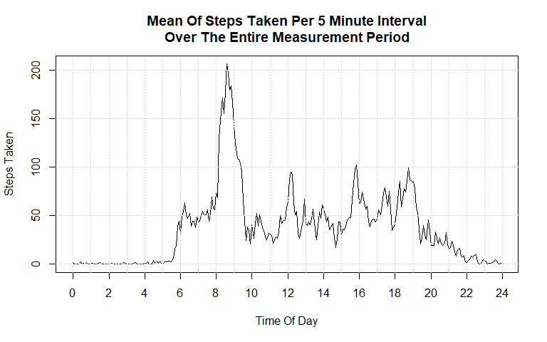
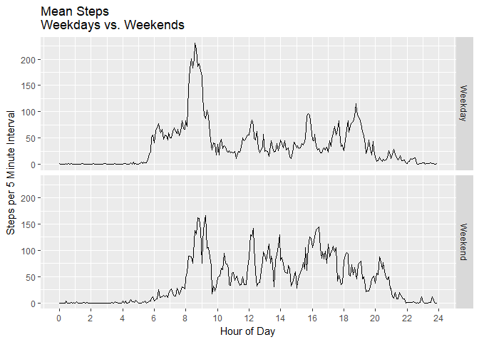

## Loading and preprocessing the data

After the csv file is extracted from the zip, the data is read to a data.frame named `data` and the unzipped file is removed, to prevent committing an unneeded leftover file to github.  A fraction form of the time of day is calculated to facilitate accurate plotting. 


```r
library(tidyr, warn.conflicts = FALSE)
library(dplyr, warn.conflicts = FALSE)
library(ggplot2)
unzipped.data.file <- unzip("activity.zip")
data <- read.csv(file = unzipped.data.file)
file.remove(unzipped.data.file)
rm(unzipped.data.file)
```


## What is mean total number of steps taken per day?


```r
dailytotals <- tapply(data$steps, data$date, sum, na.rm = TRUE)
hist(dailytotals, breaks = 50)
```

<!-- -->

```r
print(paste("The mean total number of steps taken per day is", round(mean(dailytotals), 1)))
```

```
## [1] "The mean total number of steps taken per day is 9354.2"
```

```r
print(paste("The median total number of steps taken per day is", median(dailytotals)))
```

```
## [1] "The median total number of steps taken per day is 10395"
```
Alternatively, the better looking way to do this (but it does not echo code) is:

The mean total number of steps taken per day is 9354.2  
The median total number of steps taken per day is 10395


## What is the average daily activity pattern?


```r
intervaltotals <- tapply(data$steps, data$interval, mean, na.rm = TRUE)
interval.df <- data.frame(interval = as.integer(names(intervaltotals)), 
                         Steps = intervaltotals)

interval.df <- mutate(interval.df, decimal.hour = floor(interval / 100) + (interval %% 100) / 60)
peak.interval <- which.max(interval.df$Steps)

plot(x = interval.df$decimal.hour, 
     xlab = "Time Of Day",
     y = interval.df$Steps, 
     ylab = "Steps Taken",
     type = "l",
     main = "Mean Of Steps Taken Per 5 Minute Interval\nOver The Entire Measurement Period",
     xaxt = "n")
axis(side = 1,
     at = seq.int(0, 24, by = 2),
     labels = seq.int(0, 24, by = 2))
grid(ny = NULL)
dummy <- lapply(seq.int(0, 24), function(x) abline(v=x, col = "lightgray", lty = "dotted"))
```

<!-- -->

```r
print(paste("The time interval with the highest average step count is", interval.df$interval[peak.interval]))
```

```
## [1] "The time interval with the highest average step count is 835"
```

## Imputing missing values

The data contains 2304 unknown values.  These values will be replaced with the mean number of steps reported for the same time interval on other days in the measurement period.  


```r
na.indexes <- which(is.na(data$steps))

# generate the imputed data.frame
imputed.df <- data
for (r in 1:nrow(imputed.df)) {
    if (is.na(imputed.df[r,"steps"])) {
        interval <- imputed.df[r,"interval"]
        imputed.df[r,"steps"] <- interval.df[interval.df$interval == interval,"Steps"]
    }
}
# the imputed data is now correct in imputed.df

dailytotals <- tapply(imputed.df$steps, imputed.df$date, sum)
hist(dailytotals, breaks = 50)
```

<!-- -->

```r
print(paste("The mean total number of steps taken per day is", round(mean(dailytotals), 1)))
```

```
## [1] "The mean total number of steps taken per day is 10766.2"
```

```r
print(paste("The median total number of steps taken per day is", median(dailytotals)))
```

```
## [1] "The median total number of steps taken per day is 10766.1886792453"
```
These values are higher than the previously calculated totals that don't include imputed data.  This is reasonable in that a significant number of missing measurements have been imputed with positive step counts, and so the overall total number of countable steps is increased, bringing a corresponding increase to both indicators of daily average. 

The mean total is affected more than the median, which also is reasonably explained.  Missing measurements in the original data have a direct effect on the mean by lowering the overall sum of all countable steps, whereas the median total is less impacted because it is chosen from among a group of typical days with actual measured step counts.  A majority of reported days are not impacted by missing numbers. 

The identical values of the mean and median daily step totals may at first seem surprising, but this too has a reasonable explanation.  There are a number of days in the original data with no available step counts for any time interval.  When imputing those missing values with the mean of all reported values for matching time intervals of other days, we create days that have total step counts equal to the mean daily total for the days with reported numbers.  The likelihood of a day with all imputed step counts representing the median of all days increases with the number of such days (there are 8 out of a total of 61 reported days).  This effect is observed by listing all daily totals in ascending order for the imputed data as follows:

```r
as.vector(dailytotals[order(dailytotals)])
```

```
##  [1]    41.00   126.00  2492.00  3219.00  4472.00  5018.00  5441.00
##  [8]  6778.00  7047.00  7336.00  8334.00  8355.00  8821.00  8841.00
## [15]  8918.00  9819.00  9900.00 10056.00 10119.00 10139.00 10183.00
## [22] 10304.00 10395.00 10439.00 10571.00 10600.00 10765.00 10766.19
## [29] 10766.19 10766.19 10766.19 10766.19 10766.19 10766.19 10766.19
## [36] 11015.00 11162.00 11352.00 11458.00 11829.00 11834.00 12116.00
## [43] 12426.00 12608.00 12787.00 12811.00 12883.00 13294.00 13452.00
## [50] 13460.00 13646.00 14339.00 14478.00 15084.00 15098.00 15110.00
## [57] 15414.00 15420.00 17382.00 20427.00 21194.00
```
Note that the indexes range from 1 to 61 so the median value is to be found at index 31, which is 10766.19, the same as the mean over all days.  

## Are there differences in activity patterns between weekdays and weekends?


```r
daytype <- sapply(imputed.df$date, function(x) {
    d <- as.Date(x)
    w <- weekdays(d)
    if (grepl("^(Sat|Sun)", w, ignore.case = TRUE)) {
        as.factor("Weekend")
    }
    else {
        as.factor("Weekday")
    }
    })

date.typed.df <- mutate(imputed.df, daytype)

split.interval.df <- split(date.typed.df, date.typed.df$daytype)

weekend.intervaltotals <- tapply(split.interval.df[["Weekend"]]$steps, split.interval.df[["Weekend"]]$interval, mean, na.rm = TRUE)
weekend.intervaltotals <- data.frame(interval = as.integer(names(weekend.intervaltotals)), mean.steps = weekend.intervaltotals)

weekday.intervaltotals <- tapply(split.interval.df[["Weekday"]]$steps, split.interval.df[["Weekday"]]$interval, mean, na.rm = TRUE)
weekday.intervaltotals <- data.frame(interval = as.integer(names(weekday.intervaltotals)), mean.steps = weekday.intervaltotals)

means.by.daytype <- merge(weekday.intervaltotals, weekend.intervaltotals, by = "interval", suffixes = c(".Weekday", ".Weekend"))

means.by.daytype <- gather(data = means.by.daytype, key = "day.type", value = "mean.steps", -interval)
x <- separate(data = means.by.daytype, col = day.type, into = c("trash", "daytype"), sep = 11, remove = TRUE)
x$daytype <- as.factor(x$daytype)
x <- mutate(x, decimal.hour = floor(interval / 100) + (interval %% 100) / 60)

#plot(x = x$decimal.hour, y = x$mean.steps, col = x$daytype)

# qplot(x = interval, y = mean.steps, data = x, facets = daytype ~ .)
p <- ggplot(data = x, aes(x = decimal.hour, y = mean.steps)) +
     geom_line() + 
     facet_grid( daytype ~ .) + 
     facet_grid( daytype ~ .) +
     labs(x = "Hour of Day", y = "Steps per 5 Minute Interval", title = "Mean Steps\nWeekdays vs. Weekends") +
     scale_x_continuous(breaks = seq(0, 24, by=2))
print(p)
```

<!-- -->

